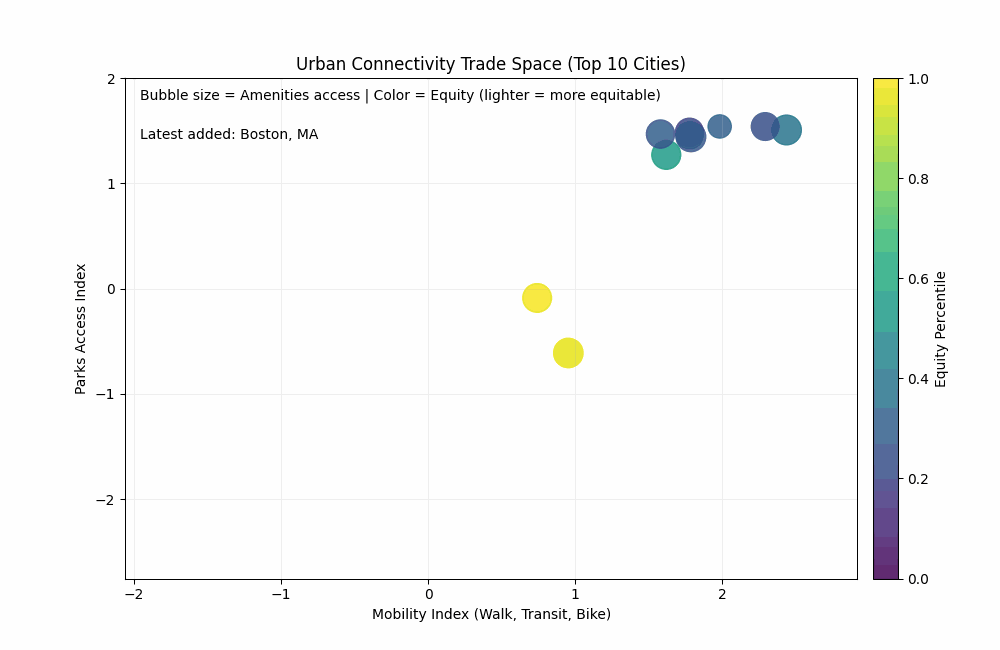
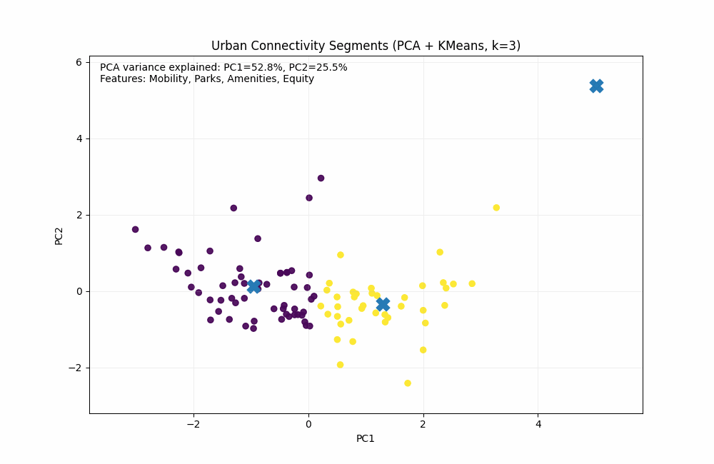

# US Urban Connectivity and 15-Minute City Indicators

A dashboard-only analytics project that benchmarks **100+ major US cities (population > 200,000)** across indicators aligned with the **15-minute city** concept: walkability, transit access, bike infrastructure, parks/public space, and equity-focused access measures.

---

## Open the Dashboard

[](https://urban-connectivity-and-active-transportation-in-us-cities-scjm.streamlit.app/)

---

## Key Visualizations

### Urban Connectivity Trade Space
Mobility vs parks access, with amenities and equity layered in to reveal multi-dimensional tradeoffs.



### City Segmentation (PCA + KMeans)
Cities clustered in a reduced connectivity feature space to highlight distinct “types” of urban performance profiles.



---

## What This Dashboard Covers

The dashboard supports:
- **City benchmarking** and ranking using a composite connectivity score
- **Explainable scoring** using high-level components (Mobility, Parks, Amenities, Equity)
- **Equity lens** via access-gap metrics where available
- **Segmentation** to compare cities with similar accessibility profiles

---

## Data Sources

This dataset combines indicators from two sources:

- **Walk Score**
  - Walkability
  - Transit accessibility
  - Bike infrastructure / bike-friendliness

- **Trust for Public Land (TPL)**
  - Population density (Census)
  - Parks and public space indicators
  - Equity-focused access metrics (including BIPOC access measures)

The dataset includes **100 US cities with populations over 200,000**.

---

## Repository Structure

```text
.
├── app.py                         # Streamlit dashboard
├── requirements.txt               # Dependencies for deployment
├── data/
│   └── urban_connectivity.csv     # Dataset (as provided)
└── assets/
    ├── trade_space_urban_connectivity.gif
    └── pca_clustering_urban_connectivity.gif
